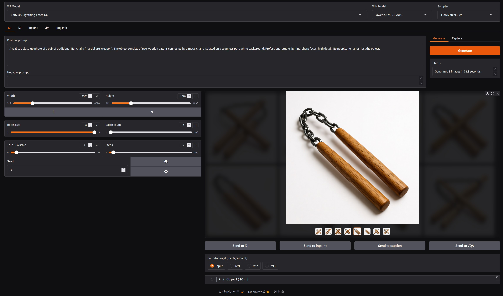
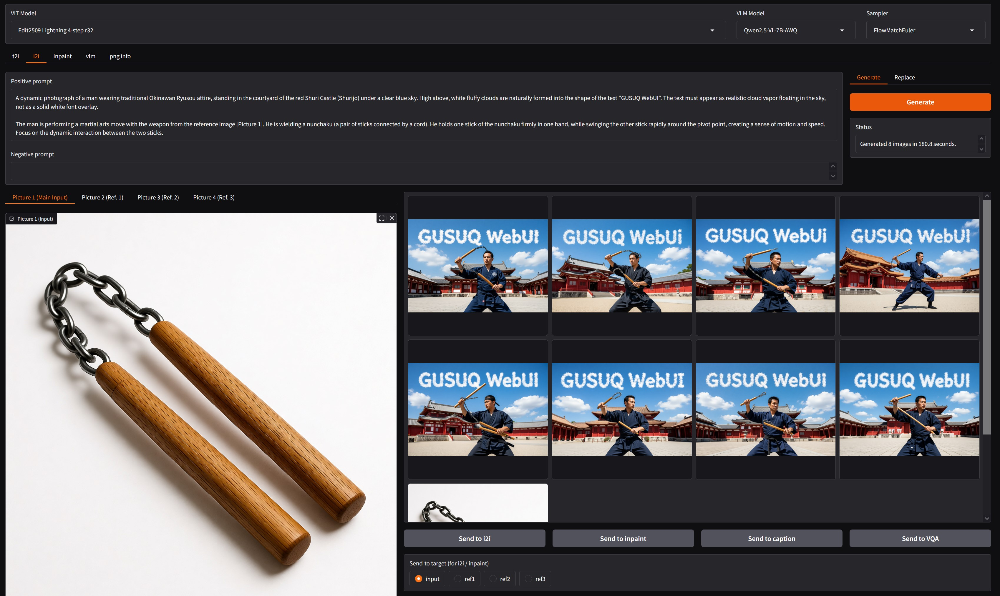

# GUSUQ WebUI – Gradio-based Unified Simple UI for Qwen-image with Nunchaku


## Installation

- requirements:
    - A system with a compatible NVIDIA GPU
    - GPU memory: 12GB+ VRAM (8GB / 11GB may be work with low_vram offloading, but not tested)
    - System memory: 32GB+? (32GB may be tight)
    - Python 3 (recommended 3.11 or later)

1. Install system dependencies:
    - Install git, CUDA
    - Install python and build tools
        - Linux (Ubuntu) / WSL:
            ```bash
            sudo apt update
            sudo apt install build-essential python3-dev # python 3.12 for Ubuntu 24.04
            # sudo apt install build-essential python3.13 python3.13-venv python3.13-dev # other python versions (example: python 3.13). Deadsnakes PPA may be needed.
            ```

2. Clone this repository:

    ```bash
    git clone https://github.com/Ai-tensa/GUSUQ-WebUI.git
    cd GUSUQ-WebUI
    python3 -m venv {venv_name} # Create a virtual environment (optional. other methods like conda are also fine)
    source {venv_name}/bin/activate # Activate the virtual environment (Linux/Mac)
    .\{venv_name}\Scripts\activate # Activate the virtual environment (Windows)
    ```
3. Install the required dependencies:
    1. Install pytorch and nunchaku according to your CUDA version and Python version from [pytorch.org](https://pytorch.org/get-started/locally/) and [nunchaku releases](https://github.com/nunchaku-tech/nunchaku).
    Since these packages depend on your system configuration deeply, please check and select the appropriate versions in their official websites.
    I tested pytorch 2.8.0 and nunchaku 1.0.2, but you can try other versions as well. 

        Note:
        If you use Linux/WSL, python 3.12 and CUDA 12.8, you can use `requirements.txt` with just uncomment (skip this step).

        Example for CUDA 12.6 and Python 3.13:
        ```bash
        pip install torch==2.8.0+cu126 torchvision==0.23.0+cu126 torchaudio==2.8.0 --extra-index-url https://download.pytorch.org/whl/cu126
        ```
        Then install nunchaku for Linux and Python 3.13:
        ```bash
        pip install https://github.com/nunchaku-tech/nunchaku/releases/download/v1.0.2/nunchaku-1.0.2+torch2.8-cp313-cp313-linux_x86_64.whl
        ```
    2. Install other dependencies
        (if you skipped step 3-1, uncomment the following line to install torch and nunchaku as well)
        ```bash
        pip install -r requirements.txt
        ```
    3. AutoAWQ installation (bit challenging for Windows users?):

        Note: Windows installation guide: [AutoAWQ Windows Installation Guide](https://github.com/casper-hansen/AutoAWQ/issues/704) (but I haven't tested it yet)
        1. Linux
            ```bash
            pip install autoawq==0.2.9
            ```
        2. Windows (non WSL)
            ```bash
            pip install git+https://github.com/casper-hansen/AutoAWQ.git --no-deps
            pip install datasets
            pip install triton-windows
            pip install zstandard
            ```
        3. WSL
            Not tested yet. Please try Windows installation steps above or refer to the above installation guide.
    4. Disable AutoAWQ model if you cannot install AutoAWQ:
        1. Update `default_vlm_model` in `config/user_config.yaml`:
            ```yaml
            ## Model selection defaults
            default_vlm_model: "Qwen2.5-VL-7B" # default VLM model for image generation
            ```
        2. Delete AutoAWQ model entry in `config/vlm_models.yaml`:
            ```yaml
            - name: Qwen2.5-VL-7B # 14GB, but "low_vram" offloading works well even less than 16GB VRAM
              path_or_id: Qwen/Qwen2.5-VL-7B-Instruct
            # - name: Qwen2.5-VL-7B-AWQ  # 7GB model with AutoAWQ)
            #   path_or_id: Qwen/Qwen2.5-VL-7B-Instruct-AWQ
            #   dtype: float16 # Optional, specify to override default dtype (bfloat16)
            ```
    5. Launch the web UI:
        ```bash
        python webui.py (--user-config-yaml path/to/your_config.yaml ...) # RTX 40xx orl older GPUs
        # python webui.py  --vit-models-yaml config/vit_models_sample_50xx.yaml (--user-config-yaml path/to/your_config.yaml ...) # for RTX 50xx (Blackwell) GPUs
        (python webui.py --help for more options)
        ```


## Offloading Option

"opt_policy" parameter in `config/opt_pol.yaml` allows you to choose different offloading strategies to optimize VRAM usage based on your hardware capabilities:

- low_vram: sequentially offloads both the text encoder and DiT to CPU when not in use. Minimal VRAM usage. It works even with < 16GB VRAM (such as 12GB).
- mid_vram: model-wise offloading both the text encoder and DiT to CPU when not in use. Balances VRAM usage and performance. 16GB VRAM required.
- high_vram: Offloads the text encoder to CPU when not in use. 18GB VRAM required. If you cannot run with high_vram, try mid_vram or low_vram.
- no_offload: No offloading. Requires the most VRAM. 32GB+ VRAM recommended.

## Usage (to be updated)

### t2i - Text-to-Image Generation



### i2i - Image-to-Image Generation




## License
This repository is released under the Apache License 2.0.

### Third-party / Derived code
- `qwen_image_pipelines/`: contains modifications of [HuggingFace Diffusers](https://github.com/huggingface/diffusers), licensed under the Apache License 2.0.